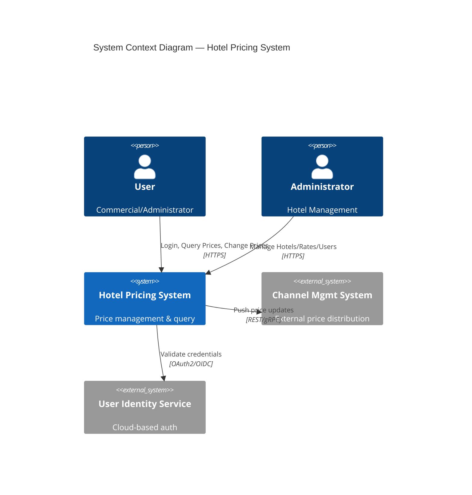

# 实验操作文档：基于 Multi-Agent + GPT-5.4 的 ADD 3.0 架构设计

> **实验组配置：** Option 3 — Multi-agent（分布式推理 + 协作验证）
> **选定模型：** GPT-5.4
> **框架：** Spring AI Alibaba
> **案例：** Hotel Pricing System（酒店定价系统）
> **方法论：** Attribute-Driven Design (ADD) 3.0

---

## 目录

1. [实验概述与目标](#1-实验概述与目标)
2. [环境准备与项目初始化](#2-环境准备与项目初始化)
3. [多 Agent 系统架构设计](#3-多-agent-系统架构设计)
4. [Agent 详细定义与 Prompt 设计](#4-agent-详细定义与-prompt-设计)
5. [迭代执行流程](#5-迭代执行流程)
6. [会话日志与输出收集](#6-会话日志与输出收集)
7. [报告撰写指南](#7-报告撰写指南)
8. [常见问题与注意事项](#8-常见问题与注意事项)

---

## 1. 实验概述与目标

### 1.1 任务目标

使用 ADD 3.0 方法为 **Hotel Pricing System（酒店定价系统）** 完成架构设计，包含以下四个迭代：

| 迭代        | 目标                     | 核心关注点                   |
| ----------- | ------------------------ | ---------------------------- |
| Iteration 1 | 建立整体系统结构         | 系统分解、顶层模块、技术选型 |
| Iteration 2 | 识别支持主要功能的结构   | Use Case 实现、组件交互      |
| Iteration 3 | 处理可靠性与可用性质属性 | QA-2, QA-3, QA-4, QA-8       |
| Iteration 4 | 处理开发与运维           | QA-6, QA-7, QA-9, CRN-5      |

### 1.2 交付物清单

| 交付物       | 分值 | 说明                                   |
| ------------ | ---- | -------------------------------------- |
| 源代码       | 15分 | 基于 Spring AI Alibaba 的多 Agent 项目 |
| 完整会话日志 | 15分 | 四个迭代与 LLM 的交互记录（含时间戳）  |
| 实验报告     | 20分 | 按附录模板撰写（全英文，≤30页 A4）     |

### 1.3 核心约束

1. **视图生成**：必须使用 Mermaid 或 PlantUML 代码生成架构图
2. **知识边界**：除给定的 Prior Knowledge 外，不得引入外部领域知识
3. **Prompt 纯净性**：不允许在 prompt 中使用 few-shot 示例或手工示范输出
4. **规则透明**：所有决策规则必须从系统指令中显式推导

---

## 2. 环境准备与项目初始化

### 2.1 前置条件

| 组件  | 版本要求                      | 验证命令           |
| ----- | ----------------------------- | ------------------ |
| JDK   | 17+                           | `java -version`    |
| Maven | 3.6+（推荐使用项目自带 mvnw） | `./mvnw --version` |
| Git   | 任意版本                      | `git --version`    |
| IDE   | IntelliJ IDEA / VS Code       | —                  |

### 2.2 项目结构

```
hotel-pricing-add/
├── pom.xml                          # Maven 配置（父POM引用Spring Boot 3.5.x）
├── src/main/java/com/hotel/pricing/
│   ├── Application.java             # Spring Boot 入口
│   ├── config/
│   │   ├── ModelConfig.java         # GPT-5.4 ChatModel 配置
│   │   ├── AgentConfig.java         # 多 Agent 定义与装配
│   │   └── GraphConfig.java         # StateGraph 工作流配置
│   ├── agents/
│   │   ├── ArchitectAgent.java      # 主架构师 Agent（Supervisor）
│   │   ├── AnalystAgent.java        # 分析师 Agent（驱动分解）
│   │   ├── QualityAgent.java        # 质量属性 Agent（QA验证）
│   │   └── ReviewerAgent.java       # 审查 Agent（协作验证）
│   ├── state/
│   │   └── IterationState.java      # 迭代状态定义
│   ├── tools/
│   │   ├── DiagramTool.java         # Mermaid/PlantUML 生成工具
│   │   ├── DocumentTool.java        # 设计文档读写工具
│   │   └── VerificationTool.java    # 设计验证工具
│   ├── runner/
│   │   └── IterationRunner.java     # 四个迭代的执行器
│   └── service/
│       └── ADDOrchestrationService.java  # ADD 流程编排
├── src/main/resources/
│   ├── application.yml              # 应用配置
│   ├── prompts/
│   │   ├── prior-knowledge.txt      # Prior Knowledge — ADD 3.0 方法论
│   │   ├── case-study.txt           # Prior Knowledge — Hotel Pricing System
│   │   ├── architect-role.txt       # Architect Agent 角色 Prompt
│   │   ├── analyst-role.txt         # Analyst Agent 角色 Prompt
│   │   ├── quality-role.txt         # Quality Agent 角色 Prompt
│   │   └── reviewer-role.txt        # Reviewer Agent 角色 Prompt
│   └── output/                      # 会话日志与图表输出目录
└── README.md
```

### 2.3 Maven 依赖配置 (`pom.xml`)

```xml
<!-- 伪代码：pom.xml 核心依赖 -->
<parent>
    <groupId>org.springframework.boot</groupId>
    <artifactId>spring-boot-starter-parent</artifactId>
    <version>3.5.7</version>
</parent>

<properties>
    <java.version>17</java.version>
    <spring-ai.version>1.1.2</spring-ai.version>
    <spring-ai-alibaba.version>1.1.2.2</spring-ai-alibaba.version>
</properties>

<dependencies>
    <!-- Spring AI Alibaba Agent Framework（多Agent核心） -->
    <dependency>
        <groupId>com.alibaba.cloud.ai</groupId>
        <artifactId>spring-ai-alibaba-agent-framework</artifactId>
    </dependency>

    <!-- Spring AI OpenAI Starter（接入GPT-5.4） -->
    <dependency>
        <groupId>org.springframework.ai</groupId>
        <artifactId>spring-ai-starter-model-openai</artifactId>
    </dependency>

    <!-- Spring AI Alibaba Studio（可视化调试） -->
    <dependency>
        <groupId>com.alibaba.cloud.ai</groupId>
        <artifactId>spring-ai-alibaba-studio</artifactId>
    </dependency>

    <!-- Spring Boot Web -->
    <dependency>
        <groupId>org.springframework.boot</groupId>
        <artifactId>spring-boot-starter-web</artifactId>
    </dependency>
</dependencies>
```

### 2.4 GPT-5.4 模型配置 (`application.yml`)

```yaml
# 伪代码：application.yml 核心配置
spring:
  ai:
    openai:
      api-key: ${OPENAI_API_KEY}           # 助教分发的API Key
      base-url: ${OPENAI_BASE_URL}         # GPT-5.4 API端点
      chat:
        options:
          model: gpt-5.4                    # 模型名称
          temperature: 0.3                  # 低温度保证设计一致性
          max-tokens: 16384                 # 输出上限

  # Spring AI Alibaba Studio 配置
  alibaba:
    cloud:
      ai:
        studio:
          enabled: true                     # 开启可视化调试界面

# 日志配置（记录完整会话）
logging:
  level:
    com.hotel.pricing: DEBUG
    com.alibaba.cloud.ai.graph: DEBUG       # 记录Agent内部推理
  file:
    path: ./logs
    name: logs/conversation.log
```

### 2.5 项目初始化步骤

```bash
# Step 1: 进入工作目录
cd "c:/Users/X/Documents/2026Spring_Software_Architecture_Design/Assignment2"

# Step 2: 使用 Spring Initializr 或手动创建 Maven 项目结构
# （按 2.2 节创建目录和文件）

# Step 3: 编译验证
./mvnw clean compile -DskipTests

# Step 4: 确认依赖下载成功
./mvnw dependency:tree | grep -E "spring-ai|alibaba"

# Step 5: 设置环境变量
export OPENAI_API_KEY="助教发放的API-KEY"
export OPENAI_BASE_URL="https://api.openai.com"  # 或代理地址
```

---

## 3. 多 Agent 系统架构设计

### 3.1 选用模式：Supervisor + Sub-Agent 协作验证

基于 Spring AI Alibaba 的 **Supervisor 模式**（参考 `examples/multiagent-patterns/supervisor`）与 **DeepResearch 的 Sub-Agent 模式**（参考 `examples/deepresearch`）组合：

```
                          ┌──────────────────────┐
                          │   Architect Agent     │
                          │   (Supervisor)        │
                          │   主控 ADD 流程        │
                          └──────┬───────────────┘
                                 │
                    ┌────────────┼────────────┐
                    │            │            │
              ┌─────▼─────┐ ┌───▼──────┐ ┌───▼──────┐
              │  Analyst   │ │ Quality  │ │ Reviewer │
              │  Agent     │ │ Agent    │ │ Agent    │
              │  驱动分解   │ │ QA验证   │ │ 协作审查  │
              └───────────┘ └──────────┘ └──────────┘
```

**工作流程（每个迭代内）：**

1. **Architect Agent (Supervisor)** 接收迭代目标，调用 Analyst Agent 进行驱动分解
2. **Analyst Agent** 分析当前迭代的驱动因素，提出候选设计概念
3. **Architect Agent** 综合 Analys​​t 的建议，做出设计决策
4. **Architect Agent** 将设计结果交给 Quality Agent + Reviewer Agent 并行验证
5. **Quality Agent** 从质量属性角度审查设计
6. **Reviewer Agent** 从完备性和一致性角度审查设计
7. **Architect Agent** 整合反馈，迭代修改直至收敛
8. 输出本迭代的架构视图（Mermaid/PlantUML 代码）

### 3.2 StateGraph 拓扑设计

```
[START] → [Architect(plan)] → [Analyst(decompose)] → [Architect(decide)]
    → [Parallel: QualityAgent | ReviewerAgent]
    → [Architect(review_feedback)] → [Architect(finalize)] → [END]
```

**条件路由逻辑（伪代码）：**

```
route_after_architect_plan(state):
    if iteration_goal_complete(state):
        return END
    elif needs_decomposition(state):
        return ANALYST_AGENT
    elif needs_verification(state):
        return PARALLEL_VERIFY    // 并行触发 Quality + Reviewer
    else:
        return ARCHITECT_AGENT    // 继续推理
```

---

## 4. Agent 详细定义与 Prompt 设计

### 4.1 Prior Knowledge 注入策略

所有 Agent 共享以下 Prior Knowledge（通过系统指令注入）：

```
PRIOR_KNOWLEDGE_ADD30 = """
# Attribute-Driven Design (ADD) 方法:
## Step 1 Review Inputs: 审查输入，识别架构驱动因素
## Step 2 Establish Iteration Goal: 建立迭代目标，选择驱动因素子集
## Step 3 Choose Elements to Refine: 选择需要细化的系统元素
## Step 4 Choose Design Concepts: 选择满足驱动因素的设计概念
## Step 5 Instantiate Elements, Allocate Responsibilities, Define Interfaces
## Step 6 Sketch Views and Record Design Decisions
## Step 7 Analyze Current Design, Review Goal, Iterate
"""

PRIOR_KNOWLEDGE_CASE = """
# Hotel Pricing System（酒店定价系统）:
## Use Cases: HPS-1(登录) HPS-2(改价) HPS-3(查询) HPS-4(酒店管理) HPS-5(费率管理) HPS-6(用户管理)
## Quality Attributes: QA-1~QA-9（详见案例描述）
## Constraints: CON-1~CON-6
## Architectural Concerns: CRN-1~CRN-5
"""

ITERATION_PLAN = """
- Iteration 1: Establishing an Overall System Structure
- Iteration 2: Identifying Structures to Support Primary Functionality
- Iteration 3: Addressing Reliability and Availability Quality Attributes
- Iteration 4: Addressing Development and Operations
"""
```

### 4.2 Architect Agent（Supervisor）

```
ROLE_ARCHITECT = """
You are a Chief Software Architect responsible for leading the ADD 3.0
design process for the Hotel Pricing System (a greenfield project).

Your responsibilities:
1. Follow the ADD 3.0 method step by step in each iteration
2. Decompose the iteration goal into actionable sub-tasks
3. Make explicit design decisions and record their rationale
4. Call Analyst Agent when you need deeper driver analysis
5. Call Quality Agent and Reviewer Agent for collaborative verification
6. Produce final architecture views using Mermaid code
7. All design decisions must be explicitly derived from the provided
   Prior Knowledge — no external domain knowledge is allowed

For each decision, use this format:
**Decision**: <what was decided>
**Rationale**: <why, citing specific drivers/constraints from Prior Knowledge>
**Alternatives Considered**: <what other options were evaluated>
**Implications**: <consequences for the architecture>
"""

DIALOGUE_RULES_ARCHITECT = """
When interacting with sub-agents:
- Provide them with the specific driver(s) to analyze
- Give clear instructions on what output format is expected
- After receiving their output, explicitly state whether you
  accept, reject, or modify their recommendations
- If rejecting, explain which constraint or driver the
  recommendation violates
"""
```

### 4.3 Analyst Agent（驱动分析）

```
ROLE_ANALYST = """
You are a Senior System Analyst specializing in architecture driver analysis.
Your role is to decompose architectural drivers and propose design alternatives.

For a given iteration goal and set of drivers, you will:
1. Identify which system elements are impacted by each driver
2. Propose 2-3 candidate design concepts for each refinement target
3. Evaluate each candidate against the explicit constraints in Prior Knowledge
4. Recommend one concept with justification grounded in the case study

Output format:
```
### Driver Analysis: <driver-id>
- Impacted Elements: <list>
- Design Candidates:
  1. <concept-name>: <brief description>
     - Pros: <derived from constraints>
     - Cons: <derived from constraints>
  2. ...
- Recommendation: <chosen concept> — Rationale: <reasoning>
```
"""

SELF_REFLECTION_ANALYST = """
After producing your analysis, verify:
- Is every recommendation traceable to an explicit driver or constraint?
- Have you introduced any assumption not stated in Prior Knowledge?
- Are all Mermaid diagrams syntactically correct?
If any check fails, revise your output before submitting.
"""
```

### 4.4 Quality Agent（质量属性验证）

```
ROLE_QUALITY = """
You are a Quality Assurance Architect responsible for verifying that
design decisions satisfy the specified Quality Attributes (QA-1 through QA-9).

For a given design output, you will:
1. Map each quality attribute scenario to the proposed design elements
2. Evaluate whether the design can satisfy the stated quantifiable thresholds
   (e.g., QA-1: <100ms, QA-3: 99.9% uptime, QA-4: 1M queries/day with <20% latency increase)
3. Identify any quality attribute conflicts or gaps
4. Propose concrete refinements (not vague suggestions)

Output format:
```
### QA Verification Report
| QA-ID | Satisfied? | Evidence from Design                  | Risk/Gap         |
| ----- | ---------- | ------------------------------------- | ---------------- |
| QA-1  | YES/NO     | <which design element addresses this> | <remaining risk> |
...
### Recommended Refinements
1. <specific change> — addresses <QA-ID> — Rationale: <why needed>
```
"""

SELF_REFLECTION_QUALITY = """
Before submitting, verify:
- Did you check every QA scenario against the current design?
- Are you using only the explicit thresholds stated in Prior Knowledge?
- Is every refinement grounded in a specific QA gap?
"""
```

### 4.5 Reviewer Agent（协作验证）

```
ROLE_REVIEWER = """
You are an Architecture Reviewer responsible for cross-checking the
consistency, completeness, and correctness of the design.

Your review scope:
1. **Consistency**: Do views from different iterations align?
2. **Completeness**: Are all Use Cases (HPS-1~6) addressed?
3. **Constraint Compliance**: Are all CON-1~6 satisfied?
4. **Technical Debt Risk** (CRN-4): Does the design avoid introducing debt?
5. **Team Knowledge Leverage** (CRN-2): Are Java, Angular, Kafka properly utilized?

Output format:
```
### Review Findings
**Status**: APPROVED / NEEDS_REVISION / REJECTED
**Issues Found**:
1. [Severity: HIGH/MED/LOW] <description> — Violates: <constraint/driver>
   Suggestion: <concrete fix>
2. ...
**Strengths**: <what the design gets right>
```
"""

SELF_REFLECTION_REVIEWER = """
After producing the review, verify:
- Is every issue traced to a specific constraint, driver, or concern?
- Are you suggesting changes that go beyond the Prior Knowledge?
- Have you checked cross-iteration consistency?
"""
```

### 4.6 多 Agent 配置代码（伪代码）

```java
// 伪代码：AgentConfig.java — 多Agent与StateGraph装配

@Configuration
public class AgentConfig {

    // ==================== ChatModel ====================
    @Bean
    public ChatModel chatModel(OpenAiApi openAiApi) {
        // 使用 Spring AI 的 OpenAI ChatModel
        return OpenAiChatModel.builder()
            .openAiApi(openAiApi)
            .defaultOptions(OpenAiChatOptions.builder()
                .model("gpt-5.4")
                .temperature(0.3)
                .maxTokens(16384)
                .build())
            .build();
    }

    // ==================== Sub-Agents ====================
    @Bean
    public ReactAgent architectAgent(ChatModel chatModel) {
        return ReactAgent.builder()
            .name("ArchitectAgent")
            .model(chatModel)
            .systemPrompt(PRIOR_KNOWLEDGE_ADD30 + PRIOR_KNOWLEDGE_CASE
                          + ROLE_ARCHITECT + DIALOGUE_RULES_ARCHITECT)
            .methodTools(
                // Analyst/Quality/Reviewer 包装为 AgentTool 供 Supervisor 调用
                AgentTool.getFunctionToolCallback(analystSubAgent(chatModel)),
                AgentTool.getFunctionToolCallback(qualitySubAgent(chatModel)),
                AgentTool.getFunctionToolCallback(reviewerSubAgent(chatModel))
            )
            .enableLogging(true)
            .saver(new MemorySaver())
            .build();
    }

    // Analyst 作为 Sub-Agent
    private ReactAgent analystSubAgent(ChatModel chatModel) {
        return ReactAgent.builder()
            .name("AnalystAgent")
            .model(chatModel)
            .systemPrompt(PRIOR_KNOWLEDGE_ADD30 + PRIOR_KNOWLEDGE_CASE
                          + ROLE_ANALYST + SELF_REFLECTION_ANALYST)
            .inputType(String.class)
            .build();
    }

    // Quality Agent 作为 Sub-Agent
    private ReactAgent qualitySubAgent(ChatModel chatModel) {
        return ReactAgent.builder()
            .name("QualityAgent")
            .model(chatModel)
            .systemPrompt(PRIOR_KNOWLEDGE_ADD30 + PRIOR_KNOWLEDGE_CASE
                          + ROLE_QUALITY + SELF_REFLECTION_QUALITY)
            .inputType(String.class)
            .build();
    }

    // Reviewer Agent 作为 Sub-Agent
    private ReactAgent reviewerSubAgent(ChatModel chatModel) {
        return ReactAgent.builder()
            .name("ReviewerAgent")
            .model(chatModel)
            .systemPrompt(PRIOR_KNOWLEDGE_ADD30 + PRIOR_KNOWLEDGE_CASE
                          + ROLE_REVIEWER + SELF_REFLECTION_REVIEWER)
            .inputType(String.class)
            .build();
    }

    // ==================== StateGraph 工作流 ====================
    @Bean
    public CompiledGraph addWorkflowGraph(ReactAgent architectAgent) {
        StateGraph graph = new StateGraph("ADD_3.0_Workflow", () -> {
            Map<String, KeyStrategy> strategies = new HashMap<>();
            strategies.put("messages", new AppendStrategy(false));
            strategies.put("iteration_goal", new ReplaceStrategy());
            strategies.put("design_output", new AppendStrategy(false));
            strategies.put("verification_status", new ReplaceStrategy());
            return strategies;
        });

        // 添加节点
        graph.addNode("architect_plan", architectAgent.asNode());
        graph.addNode("architect_decide", architectAgent.asNode());
        graph.addNode("architect_finalize", architectAgent.asNode());

        // 条件路由
        graph.addConditionalEdges(START,
            ctx -> "architect_plan", Map.of("architect_plan", "architect_plan"));

        graph.addConditionalEdges("architect_plan",
            ctx -> needsDecomposition(ctx) ? "architect_decide" : END,
            Map.of("architect_decide", "architect_decide", "__end__", END));

        graph.addConditionalEdges("architect_decide",
            ctx -> needsVerification(ctx) ? "architect_finalize" : "architect_plan",
            Map.of("architect_finalize", "architect_finalize",
                   "architect_plan", "architect_plan"));

        graph.addConditionalEdges("architect_finalize",
            ctx -> END,
            Map.of("__end__", END));

        return graph.compile();
    }
}
```

---

## 5. 迭代执行流程

### 5.1 通用迭代模板

每次迭代遵循统一的执行步骤：

```
═══════════════════════════════════════════
  Iteration N: <迭代目标>
═══════════════════════════════════════════

Phase 1 — 建立迭代上下文
  ├─ 将迭代目标写入 State
  ├─ 从 Prior Knowledge 中提取本迭代相关的 Drivers
  └─ Architect Agent 进行 ADD Step 1-2

Phase 2 — 驱动分析与设计
  ├─ Architect Agent 调用 Analyst Agent 分析驱动
  ├─ Architect Agent 进行 ADD Step 3-4（选择元素与设计概念）
  └─ Architect Agent 进行 ADD Step 5（实例化与接口定义）

Phase 3 — 协作验证
  ├─ Architect Agent 并行调用 Quality Agent + Reviewer Agent
  ├─ Quality Agent 验证质量属性满足度
  ├─ Reviewer Agent 审查一致性和完备性
  └─ Architect Agent 综合反馈，必要时回到 Phase 2

Phase 4 — 视图生成与记录
  ├─ Architect Agent 进行 ADD Step 6（绘制视图）
  ├─ 输出 Mermaid 代码块
  └─ Architect Agent 进行 ADD Step 7（分析当前设计，审查迭代目标）

Phase 5 — 会话日志记录
  ├─ 记录本迭代所有 Agent 交互
  ├─ 记录架构决策与理由
  └─ 记录生成的 Mermaid 图表
```

### 5.2 Iteration 1：建立整体系统结构

**输入（传递给 Architect Agent 的初始消息）：**

```
ITERATION_1_INPUT = """
## Iteration 1: Establishing an Overall System Structure

You are starting the ADD 3.0 process for the Hotel Pricing System.
This is a GREENFIELD development (complete replacement of existing system).

### Step 1 — Review Inputs:
Review all Prior Knowledge (Use Cases, Quality Attributes, Constraints,
Architectural Concerns) and identify which will serve as architectural
drivers for this iteration.

### Step 2 — Establish Iteration Goal:
The goal is to establish the overall system structure. Focus on:
- CON-1 (web browser, cross-platform)
- CON-2 (cloud identity, cloud hosting)
- CON-5 (REST APIs, future protocol support)
- CON-6 (cloud-native approach)
- CRN-1 (establish overall initial system structure)
- CRN-2 (Java, Angular, Kafka)

### For Steps 3-6:
- Select the system itself as the element to refine
- Choose design concepts for the overall structure
- Decompose into major subsystems/modules
- Define interfaces between subsystems
- Record design decisions and rationale

### Step 7:
Analyze the current design and verify the iteration goal is achieved.

### Important:
Produce ALL architecture views as Mermaid code blocks.
Document EVERY design decision using the format:
**Decision** / **Rationale** / **Alternatives** / **Implications**
"""
```

**期望输出：**
- System Context Diagram（Mermaid C4 或部署图）
- Module Decomposition View（模块分解视图）
- 初始技术栈选择决策记录
- 子系统间接口定义

### 5.3 Iteration 2：识别支持主要功能的结构

**输入：**

```
ITERATION_2_INPUT = """
## Iteration 2: Identifying Structures to Support Primary Functionality

Building on Iteration 1's overall structure, now focus on the primary
Use Cases: HPS-1 through HPS-6.

### Step 2 — Iteration Goal:
Refine the internal structure to support all six use cases, ensuring:
- QA-1: Price change publication < 100ms
- QA-4: Initial 100K queries/day, scalable to 1M
- QA-5: Authentication and authorization per user/hotel

### Step 3 — Choose Elements to Refine:
Select modules identified in Iteration 1 that participate in the use cases.

### Step 4-5:
- Design the internal architecture of each selected module
- Define component responsibilities and interfaces
- Ensure the price calculation/publishing pipeline satisfies QA-1

### Output Requirements:
- Component-and-Connector view for the Price Change flow (HPS-2)
- Module decomposition showing Use Case to component mapping
- Sequence diagrams for HPS-2 (change prices) and HPS-3 (query prices)
"""
```

**期望输出：**
- Component & Connector View（Mermaid 流程图）
- HPS-2 价格变更序列图（Mermaid sequenceDiagram）
- HPS-3 价格查询序列图
- Use Case → Component 映射表

### 5.4 Iteration 3：处理可靠性与可用性

**输入：**

```
ITERATION_3_INPUT = """
## Iteration 3: Addressing Reliability and Availability Quality Attributes

Refine the design to satisfy:
- QA-2: 100% price changes published and received by Channel Mgmt System
- QA-3: 99.9% uptime SLA for pricing queries
- QA-8: 100% of performance/reliability measures collectable

### Step 2 — Iteration Goal:
Introduce structures for reliability (message persistence, retry, idempotency)
and availability (redundancy, failover, health checks).

### Step 3 — Choose Elements to Refine:
- The price publishing pipeline (identified in Iteration 2)
- The query API service
- The Channel Management System integration point

### Key Design Challenges:
1. Guaranteeing at-least-once delivery to Channel Mgmt System
2. Handling Channel Mgmt System downtime without losing price changes
3. Meeting 99.9% availability with cloud-native patterns

### Output Requirements:
- Updated Component & Connector view with reliability mechanisms
- Deployment diagram showing redundancy
- Monitoring architecture for QA-8
"""
```

### 5.5 Iteration 4：处理开发与运维

**输入：**

```
ITERATION_4_INPUT = """
## Iteration 4: Addressing Development and Operations

Refine the design to satisfy:
- QA-6: Support gRPC endpoint without changing core components
- QA-7: Move between nonproduction environments without code changes
- QA-9: 100% of system elements support integration testing independently
- CRN-3: Allocate work to development team members
- CRN-4: Avoid technical debt
- CRN-5: Set up continuous deployment infrastructure

### Step 2 — Iteration Goal:
Introduce structures for modifiability, deployability, testability,
and establish the CI/CD pipeline and team work allocation.

### Output Requirements:
- Layered architecture view showing how gRPC addition is isolated
- Deployment pipeline diagram (Mermaid flowchart)
- Work allocation view (which team member owns which module)
- Testability architecture (test doubles, integration test boundaries)
"""
```

### 5.6 迭代执行代码（伪代码）

```java
// 伪代码：IterationRunner.java

@Component
public class IterationRunner {

    private final CompiledGraph addGraph;
    private final ConversationLogger logger;
    // ... 注入依赖

    public void runAllIterations() {
        logger.startSession("ADD_3.0_Hotel_Pricing_"
            + System.currentTimeMillis());

        // Iteration 1
        IterationResult r1 = runIteration(1, ITERATION_1_INPUT);
        logger.recordIteration(1, r1);

        // Iteration 2（传入 Iteration 1 的上下文）
        String iter2Input = buildIterationInput(2, ITERATION_2_INPUT, r1);
        IterationResult r2 = runIteration(2, iter2Input);
        logger.recordIteration(2, r2);

        // Iteration 3
        String iter3Input = buildIterationInput(3, ITERATION_3_INPUT, r1, r2);
        IterationResult r3 = runIteration(3, iter3Input);
        logger.recordIteration(3, r3);

        // Iteration 4
        String iter4Input = buildIterationInput(4, ITERATION_4_INPUT, r1, r2, r3);
        IterationResult r4 = runIteration(4, iter4Input);
        logger.recordIteration(4, r4);

        logger.endSession();
    }

    private IterationResult runIteration(int num, String input) {
        Map<String, Object> state = new HashMap<>();
        state.put("input", input);
        state.put("iteration_num", num);

        // 调用 StateGraph，触发整个 Agent 协作流程
        CompiledGraph.State snapshot = addGraph
            .invoke(state)
            .block(Duration.ofMinutes(30));

        // 从 State 中提取设计输出
        return IterationResult.builder()
            .iteration(num)
            .mermaidDiagrams(extractMermaidBlocks(snapshot))
            .designDecisions(extractDecisions(snapshot))
            .agentTraces(extractAgentMessages(snapshot))
            .build();
    }

    // 提取 Mermaid 代码块
    private List<String> extractMermaidBlocks(CompiledGraph.State state) {
        // 检测 ```mermaid ... ``` 代码块并提取
    }

    // 提取设计决策
    private List<DesignDecision> extractDecisions(CompiledGraph.State state) {
        // 检测 **Decision**: / **Rationale**: 模式的文本
    }
}
```

---

## 6. 会话日志与输出收集

### 6.1 日志记录策略

```
LOGGING_STRATEGY = """
三层日志架构：

Layer 1 — Spring AI Alibaba Graph 层（自动）
  ├─ DEBUG 级别记录所有 Agent 节点的输入/输出消息
  ├─ 记录 StateGraph 的状态转换
  └─ 记录工具调用（Sub-Agent 调用）

Layer 2 — 应用层（手动实现 ConversationLogger）
  ├─ 每个 Iteration 的开始/结束时间戳
  ├─ Architect Agent 的完整 System Prompt + User Message
  ├─ 每个 Sub-Agent 被调用时的入参和返回值
  ├─ 提取的 Mermaid 图表代码
  └─ 提取的设计决策

Layer 3 — 报告层（手动整理）
  └─ 从原始日志中选取最具代表性的交互片段
      按 ADD Step 组织，编入报告附录
"""
```

### 6.2 ConversationLogger 伪代码

```java
// 伪代码：ConversationLogger.java

@Component
public class ConversationLogger {

    private final String outputDir = "./src/main/resources/output/";
    private PrintWriter logWriter;
    private long sessionStartTime;

    public void startSession(String sessionId) {
        sessionStartTime = System.currentTimeMillis();
        logWriter = new PrintWriter(outputDir + "conversation_" + sessionId + ".log");
        logWriter.println("=".repeat(80));
        logWriter.println("ADD 3.0 Multi-Agent Conversation Log");
        logWriter.println("Session: " + sessionId);
        logWriter.println("Started: " + ISO_TIMESTAMP);
        logWriter.println("Model: GPT-5.4 | Paradigm: Multi-Agent");
        logWriter.println("=".repeat(80));
    }

    public void recordAgentCall(String agentName, String role,
                                 String input, String output) {
        logWriter.println("\n--- [" + ISO_TIMESTAMP + "] ---");
        logWriter.println("Agent: " + agentName + " (" + role + ")");
        logWriter.println("Input: " + input);
        logWriter.println("Output: " + output);
        logWriter.println("--- END " + agentName + " ---");
        logWriter.flush();
    }

    public void recordIteration(int num, IterationResult result) {
        long elapsed = System.currentTimeMillis() - sessionStartTime;
        logWriter.println("\n" + "#".repeat(60));
        logWriter.println("ITERATION " + num + " COMPLETED");
        logWriter.println("Elapsed: " + elapsed + "ms");
        logWriter.println("Mermaid Diagrams: " + result.mermaidDiagrams.size());
        logWriter.println("Design Decisions: " + result.designDecisions.size());
        logWriter.println("#".repeat(60));

        // 单独保存 Mermaid 图表
        for (int i = 0; i < result.mermaidDiagrams.size(); i++) {
            saveMermaidFile("iter" + num + "_view" + (i+1),
                            result.mermaidDiagrams.get(i));
        }
    }

    public void endSession() {
        logWriter.println("\n" + "=".repeat(80));
        logWriter.println("Session Ended: " + ISO_TIMESTAMP);
        logWriter.close();
    }
}
```

### 6.3 输出文件组织

```
src/main/resources/output/
├── conversation_<session_id>.log      # 完整会话日志
├── iteration_1/
│   ├── diagrams/
│   │   ├── iter1_system_context.mermaid
│   │   ├── iter1_module_decomposition.mermaid
│   │   └── iter1_deployment.mermaid
│   └── decisions.md                    # 设计决策汇总
├── iteration_2/
│   ├── diagrams/
│   │   ├── iter2_component_connector.mermaid
│   │   ├── iter2_sequence_hps2.mermaid
│   │   └── iter2_sequence_hps3.mermaid
│   └── decisions.md
├── iteration_3/
│   ├── diagrams/
│   │   ├── iter3_reliability_view.mermaid
│   │   ├── iter3_deployment_redundant.mermaid
│   │   └── iter3_monitoring_arch.mermaid
│   └── decisions.md
├── iteration_4/
│   ├── diagrams/
│   │   ├── iter4_layer_architecture.mermaid
│   │   ├── iter4_cicd_pipeline.mermaid
│   │   └── iter4_work_allocation.mermaid
│   └── decisions.md
└── summary/
    ├── all_mermaid_diagrams.md          # 所有图表汇总
    └── interaction_cost_analysis.md     # 交互成本分析
```

### 6.4 Mermaid 图表生成示例

```
// 伪代码：在 Agent Prompt 中要求的 Mermaid 输出格式

Architect Agent 被要求输出的 Mermaid 格式示例：


```

---

## 7. 报告撰写指南

### 7.1 报告结构（严格按附录模板）

```
报告标题：ADD 3.0 Architecture Design for Hotel Pricing System
         — Multi-Agent Approach with GPT-5.4

═══════════════════════════════════════════
Section 1: Output Results of ADD
═══════════════════════════════════════════

### 1.1 Iteration 1: Establishing an Overall System Structure

ADD Step 1 — Review Inputs:
  [从会话日志中提取：识别了哪些驱动因素，选择的理由]

ADD Step 2 — Establish Iteration Goal:
  [迭代目标及选定的驱动因素子集]

ADD Step 3 — Choose Elements to Refine:
  [选择了哪个(些)系统元素进行细化，为什么]

ADD Step 4 — Choose Design Concepts:
  [候选设计概念，评估过程，最终选择及理由]
  [附：Architect Agent 的设计决策记录]

ADD Step 5 — Instantiate Elements, Allocate Responsibilities:
  [实例化的架构元素，职责分配，接口定义]

ADD Step 6 — Sketch Views:
  [插入 Mermaid 渲染的架构视图]
  [每个视图附带简要说明]

ADD Step 7 — Analyze & Iterate:
  [设计分析结果，是否达成迭代目标]


### 1.2 Iteration 2: Identifying Structures to Support Primary Functionality
  [同上结构，重复 ADD Step 1-7]

### 1.3 Iteration 3: Addressing Reliability and Availability
  [同上结构，重复 ADD Step 1-7]

### 1.4 Iteration 4: Addressing Development and Operations
  [同上结构，重复 ADD Step 1-7]

═══════════════════════════════════════════
Section 2: Interaction Cost Analysis
═══════════════════════════════════════════

| 项目                                 | 内容                            |
| ------------------------------------ | ------------------------------- |
| The way of completing the assignment | Multi-Agent (Option 3)          |
| The LLM used                         | GPT-5.4                         |
| Number of Human Interaction turns    | [统计：人工发起的交互轮次]      |
| Token Consumption (K tokens)         | [统计：所有迭代的Token总消耗]   |
| Time Cost (min)                      | [统计：总耗时，含Agent推理时间] |

Token 消耗统计方法：
- Spring AI Alibaba 日志中可获取每次 API 调用的 token 使用量
- 汇总所有 Agent（Architect + Analyst + Quality + Reviewer）× 4个迭代
- 按 1000 tokens = 1K 单位汇报

═══════════════════════════════════════════
Section 3: Individual Reflection
═══════════════════════════════════════════

3.1 Problems Encountered and Solutions Adopted
  [列举在实验过程中遇到的具体问题及其解决方案]
  示例问题类别：
  - Agent 循环/重复推理（解决方案：设置 maxIterations 上限）
  - Mermaid 语法错误（解决方案：在 Reviewer Agent 中增加语法检查）
  - 设计决策与 Prior Knowledge 不一致（解决方案：增加验证步骤）

3.2 Personal Contributions
  | Name (Chinese) | Contributions      |
  | -------------- | ------------------ |
  | [姓名]         | [详细列出个人贡献] |
```

### 7.2 成本统计伪代码

```java
// 伪代码：Token 统计方法

public class CostAnalyzer {
    // 从会话日志中提取 Token 消耗
    public InteractionCost analyze(String sessionLogPath) {
        int totalPromptTokens = 0;
        int totalCompletionTokens = 0;
        int humanInteractionTurns = 0;

        for (String line : Files.readAllLines(Path.of(sessionLogPath))) {
            if (line.contains("prompt_tokens:")) {
                totalPromptTokens += extractValue(line);
            }
            if (line.contains("completion_tokens:")) {
                totalCompletionTokens += extractValue(line);
            }
            if (line.contains("[HUMAN_INPUT]")) {
                humanInteractionTurns++;
            }
        }

        return InteractionCost.builder()
            .paradigm("Multi-Agent")
            .model("GPT-5.4")
            .humanTurns(humanInteractionTurns)
            .totalTokensK((totalPromptTokens + totalCompletionTokens) / 1000.0)
            .timeMinutes(calculateElapsed(sessionLogPath))
            .build();
    }
}
```

---

## 8. 常见问题与注意事项

### 8.1 常见问题

| 问题                    | 原因                                   | 解决方案                                                           |
| ----------------------- | -------------------------------------- | ------------------------------------------------------------------ |
| Agent 输出偏离 ADD 流程 | Supervisor 未正确引导                  | 在迭代输入中显式列出当前应执行的 ADD Step                          |
| Sub-Agent 被重复调用    | StateGraph 路由条件未正确终止          | 在 State 中添加 `verification_count` 计数器，≥2 次后强制路由到 END |
| Mermaid 图表渲染失败    | LLM 生成的 Mermaid 语法有误            | Reviewer Agent 增加 Mermaid 语法验证步骤                           |
| Token 消耗超预期        | Agent 过度展开讨论                     | 设置 `maxTokensBeforeSummary` 触发上下文压缩                       |
| 设计决策无迹可寻        | 未在输出中强制要求引用 Prior Knowledge | 在 Architect prompt 中要求每条决策必须标注引用来源                 |

### 8.2 调优建议

```
TUNING_TIPS = """
1. Temperature 设置：
   - 架构设计任务建议 temperature = 0.2~0.4
   - 过高达导致设计不一致；过低会导致缺乏创造性方案

2. Max Tokens 设置：
   - 每个 Agent 调用建议 maxTokens = 4096~16384
   - 生成完整架构文档时需要更大的输出空间

3. Self-Reflection 策略：
   - 每个 Sub-Agent 输出后执行一次 self-check
   - 如果发现引用外部知识 → 删除该部分
   - 如果发现与 Prior Knowledge 矛盾 → 修正

4. 对话收敛控制：
   - 每个迭代最多允许 Architect Agent 调用 Sub-Agent 2轮
   - 第3轮开始只允许在已有输出上修改，不允许引入新概念

5. API 错误处理：
   - 429 (Rate Limit) → 指数退避重试（1s, 2s, 4s, 8s）
   - 500 (Server Error) → 最多重试3次
   - Context Length Exceeded → 触发 SummarizationHook 压缩历史
"""
```

### 8.3 检查清单

```
BEFORE_SUBMISSION_CHECKLIST = """
□ 四个迭代的 ADD Step 1-7 输出是否完整记录
□ 每个迭代是否至少包含 1 个 Mermaid 架构视图
□ Mermaid 图表是否能在 https://mermaid.live/ 正常渲染
□ 所有设计决策是否标注了来自 Prior Knowledge 的依据
□ 会话日志是否包含时间戳
□ 是否统计了 Token 消耗和人工交互轮次
□ 报告是否为英文撰写
□ 报告总页数是否 ≤ 30 页 A4
□ 源代码是否可编译运行
□ 是否有引入外部领域知识的痕迹
□ 个人反思部分是否真实记录了问题和贡献
"""
```

---

## 附录 A：快速启动命令汇总

```bash
# ========== 环境准备 ==========
export OPENAI_API_KEY="<助教分发的Key>"
export OPENAI_BASE_URL="<API端点URL>"

# ========== 编译运行 ==========
cd hotel-pricing-add

# 编译
./mvnw clean package -DskipTests

# 运行（从 IDE 或命令行）
./mvnw spring-boot:run

# 触发所有迭代执行（通过 REST API 或 Runner）
curl -X POST http://localhost:8080/api/add/run-all

# ========== 可视化调试 ==========
# 浏览器打开
# http://localhost:8080/chatui/index.html

# ========== 查看日志 ==========
tail -f logs/conversation.log
cat src/main/resources/output/conversation_*.log | grep "ITERATION.*COMPLETED"

# ========== 渲染 Mermaid 图表 ==========
# 方案1: 在线渲染 → https://mermaid.live/
# 方案2: VS Code 插件 → Markdown Preview Mermaid Support
# 方案3: 命令行渲染 → npx @mermaid-js/mermaid-cli mmdc -i input.mermaid -o output.png
```

## 附录 B：ADD 3.0 关键概念速查

```
ADD 3.0 七步骤速查：
┌─────────────────────────────────────────────────┐
│ Step 1: Review Inputs                           │
│   → 识别架构驱动因素 (Drivers)                    │
│   → 分类: Use Cases, QAs, Constraints, Concerns │
├─────────────────────────────────────────────────┤
│ Step 2: Establish Iteration Goal                │
│   → 从 Drivers 中选择本轮关注的子集                │
├─────────────────────────────────────────────────┤
│ Step 3: Choose Elements to Refine               │
│   → Greenfield: 从 System 本身开始               │
│   → 后续迭代: 选择前面识别出的子系统/组件           │
├─────────────────────────────────────────────────┤
│ Step 4: Choose Design Concepts                  │
│   → 列出候选方案 → 评估 → 选择一个                 │
│   → 常见概念: Layers, Microservices, Event-Driven │
├─────────────────────────────────────────────────┤
│ Step 5: Instantiate Elements, Allocate Resp.    │
│   → 实例化架构元素，分配职责，定义接口              │
├─────────────────────────────────────────────────┤
│ Step 6: Sketch Views and Record Decisions       │
│   → 绘制架构视图（Module, C&C, Allocation Views） │
│   → 使用 Mermaid / PlantUML                      │
├─────────────────────────────────────────────────┤
│ Step 7: Analyze Design, Review Iteration Goal   │
│   → 检查是否满足迭代目标                          │
│   → 识别需要在下轮迭代中处理的问题                 │
└─────────────────────────────────────────────────┘

三大视图类型：
  Module Views       → 代码组织、分层、模块分解
  C&C Views          → 运行时组件、连接器、数据流
  Allocation Views   → 部署、团队分配、物理拓扑
```

---
